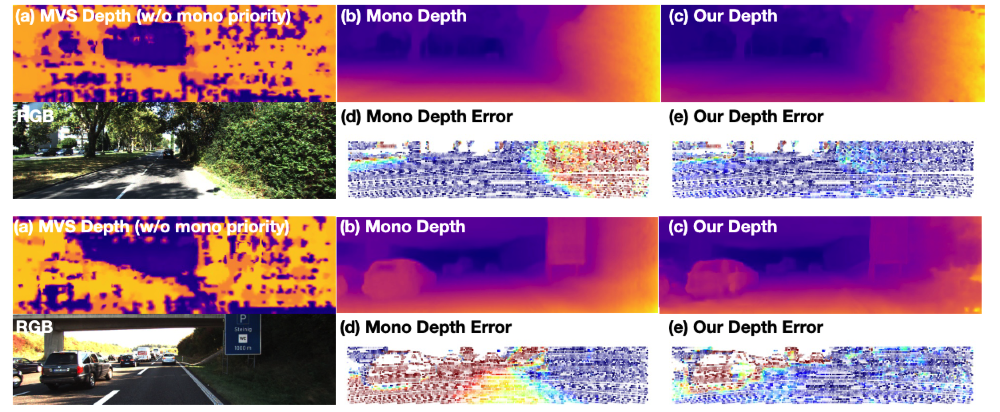

# MOVEDepth
MOVEDepth: Crafting Monocular Cues and Velocity Guidance for Self-Supervised Multi-Frame Depth Learning [arxiv](https://arxiv.org/abs/2208.09170)


This repository contains the official implementation of the paper: "Crafting Monocular Cues and Velocity Guidance for Self-Supervised Multi-Frame Depth Learning".


## Introduction
MOVEDepth is a self-supervised depth estimation method that explores monocular cues to enhance the multi-frame depth learning. The key of our approach is to utilize monocular depth as a geometric priority to construct MVS cost volume, and adjust depth candidates of cost volume under the guidance of predicted camera velocity. We further fuse monocular depth and MVS depth by learning uncertainty in the cost volume,
which results in a robust depth estimation against ambiguity in multi-view geometry.
### MOVEDepth framework

### Depth visualization



## Installation
MOVEDepth is tested on:
* python 3.7
* CUDA 11.1
### Requirements
```
pip install -r requirements.txt
```

## Training
* For instructions on preparing the KITTI dataset, see [Monodepth2](https://github.com/nianticlabs/monodepth2)


* Train MOVEDepth (Multi-GPU training): In ``train_movedepth.sh``, set ``DATA_PATH`` to your KITTI dataset path. 

* Train with GPU_NUM=4 and batch_size=6 (for different batch_size or GPU_NUM, you should adjust the learning_rate.)
```
bash ./train_movedepth.sh exp_name model_name 4 6
```
* After training, you will get model checkpoints in ./movedepth/log/exp_name/model_name.

## Testing
* In ``test_movedepth.sh``, Set ``DATA_PATH``  to your KITTI dataset path.

* Test MOVEDepth:
```
bash ./test_movedepth.sh exp_name model_name
```
* The above testing script automatically loads the model checkpoints saved in ./movedepth/log/exp_name/model_name/models/last. Or you can download my my [pretrained model](https://github.com/JeffWang987/MOVEDepth/releases/tag/pretrained), and run with:

```
bash ./test_movedepth.sh exp_name model_name --load_weights_folder PATH_TO_CKPT_FILE
```

If you find this project useful for your research, please cite: 
```
@misc{wang2022movodepth,
      title={Crafting Monocular Cues and Velocity Guidance for Self-Supervised Multi-Frame Depth Learning}, 
      author={Xiaofeng Wang and Zheng Zhu and Guan Huang and Xu Chi and Yun Ye and Ziwei Chen and Xingang Wang},
      journal={arXiv preprint arXiv:TODO},
      year={2022}
}
```


## Acknowledgements
Our work is partially baed on these opening source work: [ManyDepth](https://github.com/nianticlabs/manydepth), [monodepth2](https://github.com/nianticlabs/monodepth2), [SurroundDepth](https://github.com/weiyithu/SurroundDepth).

We appreciate their contributions to the depth learning community.
